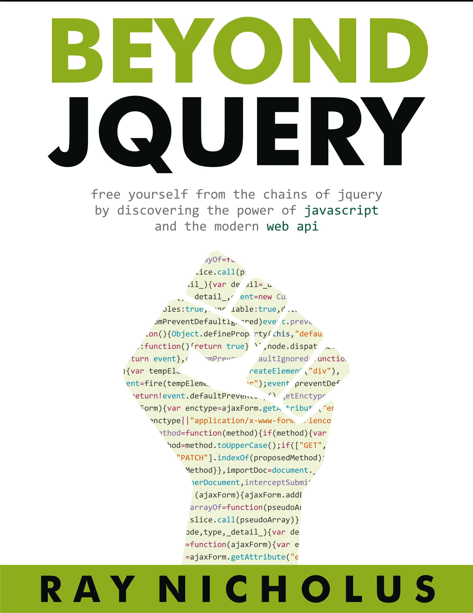

This is a book-in-progress, [currently available for purchase on Leanpub][leanpub]. It aims to educate web developers and give them the confidence to abandon their jQuery crutches and walk freely with the power of the web API and JavaScript. You will learn about the most important concepts surrounding web development as I demystify jQuery.

### How can I get a copy?

While this book is publicly available in this GitHub repository, I ask that you purchase a copy on Leanpub as I have (and continue to) put a _lot_ of work into writing and editing this manuscript. A good portion of my knowledge of frontend web development is housed in these pages, and I feel the asking price, even for an in-progress book, is very reasonable. Plus, once you purchase a copy, you'll have access to all of the updates as I write new chapters. The price will likely increase as it progresses.

### How big is this book going to be?

You can keep track of the current number of words, pages, and chapters on [the Leanpub page][leanpub], but my plan is to write about 15 chapters. I figure this will amount to between 250 and 300 pages. The outline (which evolves with each chapter) can be examined on [the Leanpub page][leanpub] as well. After it is complete, I have a potentially interested print publisher as well. So it may extend beyond Leanpub in terms of distribution.

### Why are you doing this?

What? Writing a book, or making my writing publically available instead of hiding it in a private repository? Just in case you're interested in both questions, I'll address them in order. I'm writing a book because I feel like I have a _lot_ to say on this topic. Far too many developers anchor themselves to a library like jQuery without having a good understanding of the underpinnings of the web. In fact, I was in this very situation early on in my career. I'd like to provide some of the knowledge I've gained over my career in hopes that it may help out other similar web developers.

As for the second question, I _did_ initially hide this in a private repository, up until 12 November 2015. I moved it to a _public_ GitHub repository as I felt a bit "dirty" trying to hide the underlying source. If someone really wants to avoid paying, they'll find a way. For example, [you can purchase the book and then "return" it for a full refund within 45 days, no questions asked][leanpub-faq]. Of course, you already have the PDF, so you can continue reading for free if you really want. But I have faith that other developers who find this potentially useful will contribute.  So, here it is...

### How are all of the files in the manuscript folder organized?

Everything you see in the manuscript directory is organized according to Leanpub conventions. The [book.txt](manuscript/book.txt) file describes the order of the chapters, along with front-matter (preface, intro, etc) and end-matter (about the author, appendices, etc). Each chapter is written using Leanpub-flavored markdown. You can read all about the details of this syntax in [The Leanpub Manual][leanpub-manual].

### When do you write? What is your process?

Currently, a few nights a week, [usually between the hours of 8pm and 11pm Thailand time](https://github.com/rnicholus/beyond-jquery-book/graphs/punch-card). I have other projects and responsibilties as well, so this varies a bit. I'm also [writing other stuff][raynicholus.com]. At the end of each night of writing, I typically push my changes up to GitHub. Using a webbook, Leanpub generates several preview files for me, including PDF and EPUB versions, and delivers them to my dropbox account. I spend a little time reviewing these before I stop for the night. I publish (make public) a new version of Beyond jQuery after a new chapter is completed. I typically spend a few days reviewing the chapter and making adjustments before I publish. I'm currently averaging about 1 new chapter per month.

### I found a typo or some other error

Feel free to [open up an issue][issues] or, better yet, file a pull request with the correction. I'll reward you with a coupon for a free copy of the book.

### I have a request or an idea for a previous or planned chapter

Please [open up a feature request][issues] and state your case. I'd be happy to discuss.

[issues]: https://github.com/rnicholus/beyond-jquery-book/issues/new
[leanpub]: https://leanpub.com/beyondjquery
[leanpub-faq]: https://leanpub.com/help/reader_faq
[leanpub-manual]: https://leanpub.com/help/manual
[raynicholus.com]: http://raynicholus.com/
