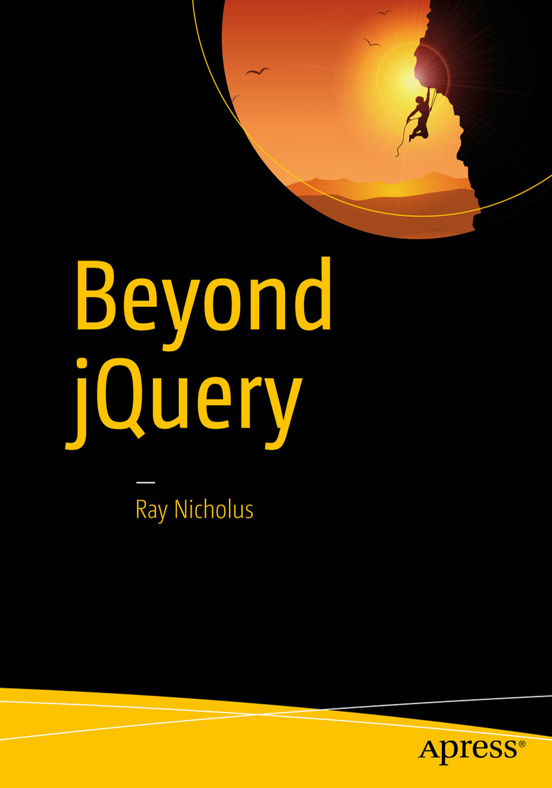

## UPDATE (20 August 2016)

Hi there readers. Thanks to all of you for supporting my work on the book over the last year and a half. It's been a long journey, a lot of work, and a lot of fun too. The next chapter in the life of "Beyond jQuery" is about to begin. My book is scheduled to be published by Apress in October of 2016. You can now [pre-order a copy on Amazon][amazon]!

I certainly hope you enjoyed reading and following my progress, and I hope you'll check out the Apress version of the book when it's ready.

If you'd like to contact me with further questions, you can find me on [Twitter][twitter].

best regards,

Ray Nicholus

### How can I get a copy?

Many places, such as Amazon.com, Barnes & Noble, and Apress.com. Beyond jQuery is currently available for pre-order on [Amazon][amazon].

### How long is this book?

13 chapters and about 300 pages.

### Why are you doing this?

I'm writing a book because I feel like I have a _lot_ to say on this topic. Far too many developers anchor themselves to a library like jQuery without having a good understanding of the underpinnings of the web. In fact, I was in this very situation early on in my career. I'd like to provide some of the knowledge I've gained over my career in hopes that it may help out other similar web developers.

### When do you write? What is your process?

Currently, most nights each week, usually between the hours of 8pm and midnight in whatever timezone I currently live in. I have other projects and responsibilities as well, so this varies a bit. I'm also [writing other stuff][raynicholus.com].

[amazon]: https://amzn.com/1484222342
[apress]: https://www.apress.com/
[raynicholus.com]: http://raynicholus.com/
[twitter]: https://twitter.com/raynicholus
