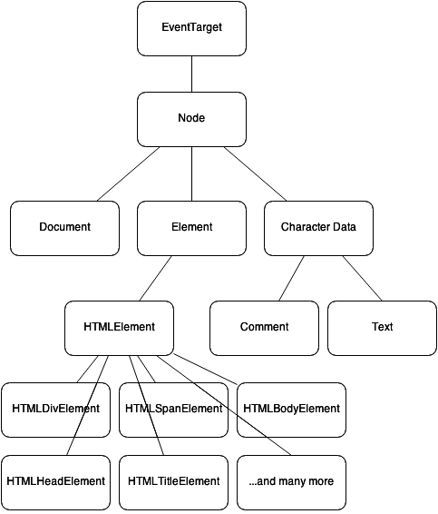

# Understanding the Web API & "Vanilla" JavaScript {#understanding-the-web}

Before we further explorer the mysteries of the browser, JavaScript, and jQuery, there are a number of important concepts and terms to cover. If your plan is to better understand all of the different native tools available to you in the browser, it is imperative that you are aware of the history of these tools _and_ how they are interrelated.

Browsers can be lumped into a few different categories. You'll hear about many terms used to describe these categories, such as “modern browser” and “evergreen browsers” both in this book, and elsewhere - something that will be discussed in more detail in this very chapter. A discerning look at the necessity of these categorizations will reveal why some of the groupings are moving targets and potentially of dubious importance. And in addition to browser-based JavaScript, you'll even learn about the how the language can be used _outside_ of browsers, such as on the server thanks to node.js.

Both the web API and the language of JavaScript are main topics of discussion in this book. Before covering the intricacies of the syntax and use of these two items, you will need to be clear about their role and importance. I will go into great detail defining the web API and JavaScript and how these two essential concepts are related. Another important goal of this chapter is to illustrate how these two technologies have been influenced by standardization. The organizations that curate these standards will be detailed. After completing this chapter, you will be quite comfortable with the various specifications that make up the native browser stack.

## Everything you need to know about browsers

In the beginning (1990), there was Nexus – the first web browser – developed by one of the founders of the modern internet: Tim Berners-Lee. Mosaic, the first fully graphical browser, followed shortly after in 1993. In 1994 and 1995, Netscape Navigator and Microsoft Internet Explorer 1.0 were released, respectively. By the mid-1990s, Netscape and Explorer accounted for almost all of the browsers in common use. They both offered a rapidly growing set of proprietary features, setting themselves apart from each other but also favoring polarity over standardization. This, in part, lead to the later popularity of tools (such as jQuery) that allowed web developers to more effectively target multiple browsers. While Nexus, Mosaic, and other similar browsers of the time were relatively short-lived and fell out of favor with users and developers, Netscape and Explorer ushered in an era of intense browser competition.

The early web was, by today's standards, uninspired and primitive. On the browser side, the web was exclusively populated with static content. Information was loaded from the server one entire page at a time, even if only a small portion of the page needed to be updated. Upon clicking on an anchor link, an HTTP GET request was sent to the server, which responded with the contents of the next page – header, body, footer and all. This did not facilitate an exceptional user experience or good use of the _very_ limited bandwidth at the time. Then came Java Applets and Flash around the late-1990s, which allowed developers to create _dynamic, in-browser_ applications. However, both of these technologies required installation of third-party software on top of the browser. Long before an official standard was codified by the World Wide Web Consortium, Microsoft allowed developers to create a page that could be partially updated by sending a request to the server that returned a fragment of a document. This fragment was then used to replace existing content _or_ create additional content without changing the rest of the page. This has been commonly known as an "Ajax" request, and its invention brought dynamic content creation to the _native_ browser. Microsoft's implementation of this concept was introduced in the late-1990s, soon after Flash and Java Applets came about. While Ajax requests were first introduced around 1999, they did not appear elsewhere until their inclusion in the Mozilla browser in 2002, and they remained non-standard until 2006. This was a time where standardization of the web crept far behind the desire for more modern features.

While Internet Explorer and its proprietary features dominated the browser market for quite some time, notable competition arrived in the early 2000s. Mozilla was the first such viable adversary to Microsoft's offering. The introduction of a free and open-source browser caught Microsoft entirely off-guard and ushered in a new era of the web. Mozilla's Gecko engine was the first such challenger to Microsoft's Trident. A few years after Gecko, Apple developed the WebKit rendering engine to power their Safari browser. Shortly after, Google developed their own browser - Chrome - also using Apple's WebKit engine. While Firefox initially grabbed a substantial share of the market on Windows, and Safari did the same on OSX, Chrome began its ascent into cross-OS dominance shortly after its introduction. Chrome's success can be attributed to its rapid evolution and significant influence of web standardization. This was a time where formal specifications _began_ to match and affect browser development. With a mature standards track and relatively solid browser quality assurance, the necessity of libraries like jQuery began to seem dubious.

The history I just outlined describes a number of different browsers, which, like most things, can be categorized in many different ways. In the context of this book, a reasonable set of categories will be used to speak to their modernity, portability, and updatability. In the following sections, you will become familiar with some of the more common browser categories. I'll also comment on the state of all currently available browsers, and provide some words of caution to consider when thinking of browsers in terms of these categories.

### Ancient browsers {#ancient-browsers}

Ancient browsers, also known as legacy browsers, are usually considered to be older versions of Microsoft's Internet Explorer. At the writing of this book, in 2015, ancient browsers are those older than Internet Explorer 9. Explorer 7 is generally thought of as the oldest browser to realistically target for any purposes. IE6, Mosaic, Netscape, and other similar browsers are not only out-of-date but also mostly unused. They are not part of any set of currently in-use browsers, so we will not consider these in any future discussions throughout this book. As of March 2015, [ancient browsers _thankfully_ only account for about 3% of currently in-use browsers across the measured web][ancientmarketshare2015].

Ancient browsers are the _most_ undesirable of all the browser categories. They suffer many drawbacks that make them difficult to develop against and support, and are generally considered to be quite slow compared to more modern choices. Their support of the DOM API and other related web APIs is primitive. They support limited JavaScript convenience methods due to lack of modern specifications at the time. Many of them, especially Internet Explorer 6, are infested with notable and serious layout bugs. For these reasons, ancient browsers have fallen out of favor, replaced with more stable, efficient, and convenient choices.

But we have to be careful when categorizing browsers using age as the key property. Ancient browsers represent a moving target. A new browser today will likely be considered an ancient browser several years from now. An ancient browser today will be considered dead in the near future when its market share effectively drops to 0. This type of categorization is not a particularly pragmatic one, but is arguably effective enough for the purposes of separating those browsers that can be reasonably addressed without jQuery in all cases, from those that cannot. However, we will explore other more effective techniques in future chapters to distinguish between capable and non-capable browsers through the practice of programatic feature detection.

### Modern browsers {#modern-browsers}

The "modern" adjective can be used to describe all browsers newer than those thought of as "ancient". At the  writing of this book, modern browsers are all those newer than and including Internet Explorer 9. This list also includes Chrome, Firefox, and Safari version 6+. But this "modern" categorization _does_ share a common trait with the "ancient" one. The trailing edge of this category is a moving target. What is modern now may be ancient in a few years. Similar to the "ancient" category, this term is simply to be used as context when reading this book that I will often use when describing the browser support for a fragment of code.

Modern browsers are, compared to their ancient counterparts, much easier to work with due to their relatively evolved developer tools, web API and JavaScript support, and stability. They account for a set of browsers that can be eloquently addressed without the help of a wrapper library like jQuery. The urge to pragmatically identify this class of browser is great. If we can easily determine if we are dealing with Internet Explorer 9 versus 8, or Safari 8 versus 5, then perhaps we can then define two discrete code paths – one for ancient browsers, and another for modern ones. But you should resist this urge.

This blanket classification of browsers, based mainly on age, is frivolous. Even worse is identifying browsers in this category and making all of your code path decisions based on the browser's [user agent identification string](#user-agent-strings). The correct approach is to test a browser's API implementation for the presence of, or lack of, a specific feature and _then_ take the appropriate code path for _that specific feature_. I want to make this clear to be sure that the classifications I have proposed thus far are seen in the proper context and not elevated to a higher level of importance than they deserve.

I> ## User agent strings {#user-agent-strings}
I>
I> A user agent string is a series of characters that identifies a particular type and version of web browser. You can obtain the browser's UA string via JavaScript by checking the `userAgent` property of the `navigator` object.

### Evergreen browsers {#evergreen-browsers}

There is a third class of browser, one that is ageless and ever evolving. Evergreen browsers are the future of the web. Browsers that fit into this category update themselves without any required user intervention. While they _are_ versioned, most who use an evergreen browser are likely unaware of their browser's current version number. Updates are completely transparent, even major version upgrades. This allows the browser to seamlessly evolve its web API and JavaScript support. There is generally no option for the user to (easily) remain on an older version. This allows these browsers to more quickly realize new web specifications, and ensure the entire user base is current. The entire ecosystem wins.

Currently, Chrome, Firefox, Safari, Opera, and Internet Explorer 10+ are considered to be evergreen browsers. This concept is quite popular and accounts for the majority of browsers available today. The model of tying a browser version to a specific set of operating system versions or "service packs" mostly died with Internet Explorer 9 and Windows Vista. Microsoft's newest re-designed browser, known as Microsoft Edge, is more like the other traditional evergreen browsers in the sense that the version number will be less prominent compared to earlier Microsoft-created offerings. As evergreen browsers take over the web, we can expect to take advantage of the rapidly evolving specifications, security improvements, and bug fixes faster than ever before. In this world, the need for a library to fill in the browser's gaps becomes much less important.

### Mobile browsers

Desktop browsers still account for the majority of web traffic, at least in the United States. However, current measurements show that mobile browser use is rising while desktop traffic is falling. As of March 2015, [mobile/tablet devices account for about 38% of web traffic][march2015mobiletraffic], with the remainder mostly attributable to desktop browsers. The steady rise in mobile device use, along with a consistent (and important) mantra of ["mobile first"][mobilefirst], reveal that mobile browsers are just as big a part of the future of the web as [evergreen browsers](#evergreen-browsers). The mobile web is still arguably in its infancy, but it cannot and should not be ignored.

In every important respect, mobile browsers are very much evergreen browsers as well. This is largely due to the fact that they are automatically updated without user intervention. Just as on the desktop, this behavior allows mobile browsing to evolve rapidly and ensures that users are always equipped with the most up-to-date version of their browser of choice. But the benefits of an automatically updating browser have historically been tied to the capabilities of the physical device. For example, old phones running Android 2.x are likely not able to handle a 4.x version, cutting them off from the latest versions of mobile Chrome. The same problem exists on other mobile platforms, such as on older Apple devices stuck on outdated builds of iOS.

The mobile landscape is largely dominated by Apple's iPhone and iPad running iOS and a multitude of other devices running Google's Android operating system. Though [Microsoft is beginning to make a small impression with their Windows Phone operating system][windows-phone-share]. Research in Motion's Blackberry OS is, for the purposes of this book (and most other contexts) irrelevant due to its small and declining share of mobile web traffic. Regardless of the mobile device, keep in mind that the code and techniques used to replace jQuery in this book will apply equally to all modern/evergreen browsers, so the distinction between mobile and desktop is not particularly important in this context, other than for performance considerations.

Even with the rising ubiquitousness of the mobile web, the current situation is not all roses and sunshine. Mobile browsers present unique challenges. Profile and battery considerations make performance consequences of our code more noticeable, compared to desktop systems. Mobile browsers in particular are a bit less mature than their larger form-factor counterparts. Along with this immaturity comes more inconsistency in specification support between the various browsers. This is often more noticeable when comparing a mobile browser to it desktop counterpart. Chrome and Safari are two examples of browsers that have a presence both on mobile and desktop devices. While these browsers may share the same name across multiple platforms, their goals vary, leading to differing experiences.

In some cases, due to very mobile-unique concerns, such as data use, common portions of web specifications behave differently. Take the [`autoplay` boolean attribute on the HTML5 `<video>` element][autoplay] as an example, which will ensure the associated video begins playing immediately after loading. Desktop browsers all support this standard feature, but support on the mobile side is a bit different. Safari running on iOS does not observe this attribute [to ensure that auto-playing videos do not adversely affect a user's limited (and relatively expensive) mobile data consumption][autoplay-ios]. There are other similar examples where the unique environment of a mobile browser may result in unexpected implementation gaps. This reality must be considered when writing "mobile first" libraries and applications.

### Non-browsers

This section may seem a bit out of place, but to be complete I figured it is important to at least _touch_ on another environment where JavaScript is thriving. Full stack software development with JavaScript on both ends is possible due to the existence of node.js - a server-side runtime that uses [Chrome's JavaScript engine][v8]. Server-side JavaScript development does not include any type of web API, for obvious reasons. So, while the web-based discussions present throughout this book (and there are many) do not apply to node world, many of the pure JavaScript areas _do_ transcend the browser.

If you're not quite sure about the differences between browser-specific JavaScript and JavaScript that is codified in the language specification (and useable outside of the browser), this will be discussed a bit more later on when I compare, contrast, and define the [web API](#web-api) and [the language of JavaScript](#javascript-vs-jquery). The important takeaway here is simply to understand that _some_ of this book's content will in fact apply to server-based JavaScript development. And for the most part, JavaScript on the server provides you with relatively up-to-date support for the language specification, which means that most non-browser-specific examples in this book will be usable on the server as well.

## What is this "web API" and why is it important? {#web-api}

I have been referring to the "web API" throughout the book, and will continue to do so. But the term "web API" is not a standard or even a _common_ term, so a bit of explanation is warranted to clear up any potential ambiguity. Simply put, the web API refers to all of the JavaScript methods and objects that specifically allow developers to programmatically address and manipulate the browser. This generalized browser API is made up of two distinct parts - one being the **D**ocument **O**bject **M**odel API, which is a set of methods and properties attached to HTML document nodes. The second part can be thought of as a collection of other methods and functions available only in the browser environment but not directly related to HTML. If these terse definitions are still a bit murky, no need to worry. I promise to explain [the DOM](#dom) and [the non-DOM APIs](#non-dom) in _much_ more detail later on in this section.

So hopefully now you are a _bit_ more comfortable with this term - the web API - and how it relates to the browser. But one question still remains: Why should you care? Aside from the fact that it is a key property of the majority of the chapters and concepts in this book, it is also _the_ most important tool available to web developers. The Web API provides everything necessary to create an exceptionally customized and dynamic experience for end users and even other developers. It is constantly and rapidly evolving, such that the web is destined to ultimately replace installed applications. As a professional developer, your understanding of the web API (or lack thereof) will have a substantial effect on your ability to efficiently design and develop rich complex web applications and libraries. This book's goal is to inculcate this reality and teach you how to not only make good use of the web API in lieu of jQuery, but also to gain a better understanding of the browser environment so that you can more effectively use libraries that wrap this native API if you so choose.

### The DOM API {#dom}

The Document Object Model is commonly referred to by its acronym: the DOM. This model describes is a set of methods and objects used to represent an HTML document. These representations are often (but not exclusively) expressed using the most common language of the web: JavaScript. The DOM provides JavaScript objects that mirror elements in a document. It allows elements to be created, located, manipulated, and described. This language binding exposes a host of potential control points among all HTML elements. For example, the DOM API defines a `className` property on the the DOM's `Element` interface. This specific property allows for programmatic reading and changing of any element's CSS `class` attribute. All other HMTL elements, such as anchors (`HTMLAnchorElement`), `
` elements (`HTMLDivElement`), and `` elements (`HTMLSpanElement`), inherit from the `Element` interface and therefore _also_ include the `className` property in their JavaScript object representations.

The element hierarchy exposed in the previous `className` example is an important one to understand. Common properties and methods available on specific elements are often inherited from a more common element type. The `EventTarget` type is at the top of the chain, with all other representations of HTML nodes inheriting from this. The `EventTarget` type defines methods to register event handlers, which all other HTML items inherit. A `Node` is a sub-type of `EventTarget` that all other elements inherit from as well. This `Node` interface provides methods to clone HTML items and locate sibling nodes, among other behaviors. Sub-types of `Node` include `Element`, and `CharacterData`. `Element` objects are, just as you might expect, all nodes that can be expressed with standardized HTML tags, such as `
` and ``. `CharacterData` items are either text or comments in a document.

In addition to per-element control, the document as a whole may also be manipulated using JavaScript. In fact, there is a particular JavaScript representation of a document, aptly named the `Document` interface. A `Document` object inherits from `Node` (which, if you remember, inherits from the base type - `EventTarget`). Documents contain properties that, for example, allow all style sheets associated with the markup to be examined. A number of important methods are available as well, such as one that facilitates creation of new HTML elements. Note that _nothing_ inherits from `Document`. All properties and methods on the browser's `document` object can also be considered part of the DOM specification, for the purposes of discussion in this book.

All of these types, behaviors, properties, methods, and relationships are part of a standard - [the DOM specification][dom-spec]. This standard was first created in 1998 by the World Wide Web Consortium (W3C) as [DOM Level 1][dom-1-spec]. There have traditionally been two specific standards paths that deal with the DOM: DOM Core, and DOM HTML. DOM Core, as the spec summary points out, is "a platform- and language-neutral interface that allows programs and scripts to dynamically access and update the content, structure, and style of documents". At the writing of this book, the latest such standard (completed in 2004) is [DOM Level 3 Core][dom3core], which defines new properties on elements, such as the `textContent` property which can be used to read or set the text of a node.

The DOM _HTML_ specification summary sounds similar to DOM Core, but is actually a bit different. It claims that the spec is "a platform- and language-neutral interface that allows programs and scripts to dynamically access and update the content and structure _of HTML 4.01 and XHTML 1.0 documents_" (emphasis added by me). In other words, the DOM Core specification defines, as you might expect, core functionality that is common to all documents, and the DOM HTML specification extends this core specification a bit and provides a more HTML-specific API. The DOM HTML spec defines common properties of elements, such as `id`, `className`, and `title`. At the writing of this book, the latest DOM HTML standard is [DOM Level 2 HTML][dom2html], completed in 2003.

There are other related standards, such as the [Selectors API][selectors-api] which covers, as you might expect, selecting elements. For example, the `querySelector` and `querySelectorAll` methods are defined on both the `Document` and the `Element` interfaces to allow selection of elements in a document using CSS selector strings defined in the [Selectors specification][selectors4] (currently at Level 4). Another related specification is [the UI Events specification][events-spec] which defines native DOM events, such as mouse and keyboard events. The [DOM4 specification][dom4] attempts to aggregate all of these standards (and more).

Then there is the most widely known standard - [HTML5][html5], completed in late 2014. It is one of the latest DOM specifications and carries forward the goals of DOM4 along with a host of other non-DOM-related specifications (which I will touch on in [the next section][#non-dom]). In the context of the DOM, HTML5 defines new elements (such as `<section>`, `<footer>` and `<header>`), new attributes (such as `placeholder` and `required`), and new element methods and properties (such as `naturalWidth` and `naturalHeight` properties of image elements). This is, of course, a very small list of changes. The W3C maintains [a document that describes, in quite a bit of detail, the changes brought on by HTML5][html5-diff]. Currently, the latest in-progress specification is HTML 5.1, also curated by the World Wide Web Consortium. HTML 5.1 brings some even newer elements to the DOM. The most notable of these new elements is [`<picture>`][picture-element], which allows multiple image sources to be specified alongside cues to the browser that indicate which image to load. Picture sources can be tied to browser window size or pixel density, for example.

In short, the DOM API(s) provide a way to read, update, traverse, and create document elements using JavaScript. The elements themselves _and_ their properties are also defined by this family of specifications. The real power in the web is, in part, defined by the DOM APIs. Without it, dynamic web applications would simply not exist in their current form. The only option would be, perhaps, embedded Flash or Java applets - two technologies that are quickly becoming obsolete due to the power of the modern DOM API. And let's be clear about another thing - jQuery is built _on top of the DOM API_. Without the DOM API, jQuery would not exist either. jQuery is simply a wrapper around the DOM API, providing a level of abstraction. A large portion of "Beyond jQuery" is dedicated to using the DOM APIs with and without the aid of jQuery.

### Everything else (non-DOM) {#non-dom}

In addition to the DOM API(s), there is another set of APIs specific to the browser, and makes up all properties attached to the browser's `window` object. A browser "window" contains an HTML document and the `document` object (which is defined by the DOM API). This window can be programmatically accessed through the JavaScript `window` object - a global variable. While the DOM API defines everything attached to the `document` object, everything else attached to the `window` object is defined by a large number of other specifications. For example, the [File API][file-api], which defines a set of methods and properties use to read, write, and identify files in the browser, is represented by two interfaces: `Blob` and `File`. Both interface definitions are available on the `window` object.

Another well-known API specification with bindings to the `Window` interface is [`XMLHttpRequest`][xhr], which defines a set of methods and properties used to communicate with a server asynchronously over HTTP. And in addition to new DOM API features, the HTML5 standard defines a large swath of the properties attached to `window`. One example is [the `History` interface][history-api], which provides programmatic access to the browser's history. This is exposed as a `history` object on `window`. Yet another example is the [`Storage` interface][storage-api], which includes representations on `window` as `sessionStorage` and `localStorage` for managing temporary storage of small amounts of data in the browser.

While the HTML 5.1 specification, first discussed in [the previous section on the DOM][#dom], also plays a part in the evolution of the non-DOM APIs, it does so to a much lesser extent than the HTML5 standard. The most notable non-DOM reference in the current draft of W3C's HTML 5.1 specification is the [`fetch` API][fetch], which was actually drafted by a different standards group: WHATWG. And this brings us to a _short_ discussion regarding this relatively new phenomenon - competing web standards. On one side, we have the W3C, which has been crafting standards for the web [since 1994][w3c-history]. It is lead by Tim Berners-Lee, the inventor of the web. The origins of the web specifications we all use and love today were formally standardized by the W3C. 10 years after the W3C came along, the Web Hypertext Application Technology Working Group (WHATWG) was formed.

{#whatwg-vs-w3c}
The WHATWG promotes a "Living Standard", one that is not tied to version numbers or "levels". For example, instead of an HTML5, or an HTML5.1 spec, they simply have an "HTML" spec that is updated over time. The group has drafted some original new standards themselves, such as the previously referenced `fetch` API, along with [the `Notifications` API][notifications-spec], which enables web applications to display notifications to the user. According to their FAQ page, [the group was created out of frustration with "the W3C’s direction with XHTML, lack of interest in HTML and apparent disregard for the needs of real-world authors"][whatwg-why]. The WHATWG does appear to be a healthy counterbalance to the W3C, apparently promoting faster evolution of the web, which is of course a _good_ thing, isn't it?

## JavaScript: A Less Elegant Version of jQuery?  {#javascript-vs-jquery}

A common reason to pull in jQuery is to make up for perceived shortcomings in the underlying language itself - JavaScript. This is one of the most frivolous excuses. It's a bit much to pull in a 3rd-party dependency like jQuery simply for a marginally better way to loop over object properties and array elements. In fact, this is completely unnecessary with the existence of `forEach` and `Object.keys()`, both of which are available in modern browsers. Or perhaps you think `$.inArray()` is an important utility function to have at your disposal. The truth is, since Internet Explorer 9 - where `Array.prototype.indexOf` was made available as part of the language - the most elegant solution is to make use of "vanilla" JavaScript instead. There are, of course, many more examples which will become apparent throughout this book.

Among front-end developers, especially those with limited knowledge of web development, there is often thought to be two possible options in terms of "languages" to utilize when coding your client-side application - jQuery, or JavaScript. The flaw in this set of options is obvious to seasoned web developers - only one of these two "languages" is _actually a language_. JavaScript is, in fact, a standardized language, while jQuery simply provides a collection of utility methods that aim to make solving common problems with JavaScript easier and more elegant across a wide range of browsers. jQuery is nothing more than a collection of web API wrapper methods.

JavaScript is both ubiquitous and unavoidable when developing web applications, and with the advent of node.js JavaScript is now a viable option on the server as well. In the following sections, I intend to explain the significance of JavaScript, as a language, in the context of web development. "Beyond jQuery" does not have an explicit goal to dive deep into language syntax and core concepts such as inheritance and scope, though these forms of language details _may_ appear at times throughout the book if there is a clear tie-in to the layer of abstraction offered by jQuery. Instead, you will gain an understanding of JavaScript's connection to the web API. The history and standardization of the language will be explored as well, similar to our previous discussion of the web API.

### The language versus the web API

JavaScript is an integral component of the web API. Take the DOM, for example. While the browser DOM is usually _implemented_ in C or C++ and packaged as a layout engine (such as Safari's "Webkit" and Chrome's "Blink") the DOM is most commonly _manipulated_ using JavaScript. For example, consider working with DOM element attributes for a moment. To do this, there are three attribute-related methods described in DOM Level 1: [`getAttribute`][getattribute], [`setAttribute`][setattribute], and [`removeAttribute`][removeattribute]. Additionally, DOM Level 2 provides [`hasAttribute`][hasattribute]. All four of these methods are defined in the `Element` interface, which has a corresponding (and commonly known) implementation in JavaScript. Given any HTML element, you can read and manipulate its attributes in JavaScript just as they are defined in these specifications. [Chapter 5](#element-attributes) will include _much_ more detail on the topic of attributes.

In addition to the DOM, JavaScript is also used when interacting with portions of the web API that are not tied to the DOM, such as [the Web Messaging API][web-messaging], which is part of the W3C's HTML5 specification. The Web Messaging API provides a way for different browsing contexts to communicate with each other via message passing. This opens up an easy way for two `iframe`s on differing domains to communicate, or even communication between the browser's main UI thread and a [Web Worker threads][web-workers]. This specification defines a [`MessageEvent` interface][messageevent], which allows a client to listen for passed messages. In JavaScript, this event object is implemented in all modern browsers, and allows developers to listen for messages using the `addEventListener` method available on the `window` object. The `window` object gets this method from the `EventTarget` interface, which you may remember from earlier in this chapter, is the top-level interface from which many other native browser objects inherit from. I will go into much more detail regarding event handling in [chapter 9](#browser-events). The Web Messaging API will be covered in a bit more detail as part of [chapter 8](#ajax-requests).

While JavaScript is key to working with native browser-specific APIs, as a language it is _not_ to be confused with the web specifications themselves. JavaScript is used to interface with implementations of these web specifications in the browser, but the language itself has its _own_ specification - [ECMAScript][ecmascript], which I will discuss a bit more in [the next section][#js-history]. Note that it is _not_ tied to the web, though it is implemented in all web browsers. The web API, in some ways, builds on the foundation provided by the JavaScript API. [`Array`s][array], [`Object`s][object], [`Function`s][function], and [primitives (such as `boolean`s and `string`s)][primitive] are all defined in the JavaScript spec and available in the browser (among other environments). And these core elements of the ECMAScript specification are further defined to have additional properties. For example, `Array`s contain a method to retrieve the index of a specific item, implemented as [`indexOf`][array.indexof]. And the `Function` interface contains [`apply`][function.apply] or [`call`][function.call] methods which make it easy to invoke a function with an alternate context (value of [`this`][execution-context]) as well as pass arguments. [Chapter 13](#javascript-utilities) will include a great amount of detail relating to JavaScript-specific utility functions, comparing them to jQuery's higher-level wrapper methods.

### History and standardization {#js-history}

The story of JavaScript starts with Brendan Eich, who, as an employee of Netscape in 1995, developed the first working version of the language in 10 days. A scripting language to run inside Netscape Navigator was to be created, and it was ordered to be "like Java". Eich was appointed to undertake this vision and make it a reality. The result was a mix of C, [Self][self], and [Scheme][scheme], with a hint of [Java][java]. [More details of the incarnation of JavaScript can be found in Brendan Eich's blog][eich-js-history].

Before a formal standardization process was created, JavaScript was, for all intents and purposes, a proprietary language only used by Netscape in their flagship browser. But shortly after implementing the language in Netscape Navigator, Microsoft created their own implementation - JScript - which was first introduced in Internet Explorer 3. Despite the different name, JScript was mostly identical to Netscape's JavaScript. [The name was changed by Microsoft to avoid any potential trademark disputes by the owner of the Java trademark][jscript-name], which was Sun Microsystems at the time.

Very shortly after the arrival of JScript, a formal language specification was drafted and later adopted. But the lack of standardization, even for a relatively short amount of time, had taken a noticeable toll on the web. In late 1996, Netscape approached the European Computer Manufacturer's Association (ECMA) to create a formal language specification. This was, in part, prompted by the divergence between implementations of the language between Netscape Navigator and Microsoft Internet Explorer 3. The [first spec was completed in June 1997 under the name ECMA-262][ecma-262], also known as ECMAScript. The specification is currently curated by ECMA Technical Committee 39, also known as [TC39][tc39] - a group of individuals entrusted to evolve and maintain the language. Members of TC39 include heavy-hitters such as Douglas Crockford, Brendan Eich, and Yehuda Katz (who is also a member of the jQuery Foundation).

The first version of the ECMAScript language specification was released in 1997, titled "ECMAScript-262 1st Edition". At the writing of this book, the 6th edition is currently being drafted. While releases of new specifications were inconsistent throughout the life of the language, as of the 6th edition, the concept of an annual release of updated specifications seems to be gaining momentum. Lending some credence to this goal, the 6th edition of the spec is also titled "ECMAScript 2015", with the assumption that edition 7 will be ECMAScrpt 2016, and so forth. A set of "harmony" specification(s) have also been a point of discussion, and the crux of this nomenclature seems to be related to the general order of the spec. Version 4 and earlier were _not_ harmonious, while version 5 and on _are_, earning this period of the specification the name "harmony". It should be noted that version 4 of the specification was never actually completed. Instead, it was rolled into ECMAScript 5. [Harmony][harmony-wiki], in this context, may refer to the goals and requirements, such as "Be a better language for writing", and "Keep the language pleasant for casual developers". Another goal of the harmony movement of the language specification is to "build on ES5 strict mode to avoid too many modes". In other words, simplification and usability bring harmony to the language. At the writing of "Beyond jQuery", browser support of ECMAScript 3 includes all browsers in existence. ECMAScript 5 support is covered entirely by all ["modern" browsers](#modern-browsers). ECMAScript 2015 has spotty support across the some current versions of all browsers at this time, though Chrome and Firefox has fairly decent coverage of the spec, as does Microsoft Edge.

[ancientmarketshare2015]:  http://www.w3counter.com/globalstats.php?year=2015&month=3

[array]: http://www.ecma-international.org/ecma-262/5.1/#sec-15.4

[array.indexof]: http://www.ecma-international.org/ecma-262/5.1/#sec-15.4.4.14

[autoplay]: http://www.w3.org/TR/html5/embedded-content-0.html#attr-media-autoplay

[autoplay-ios]: https://developer.apple.com/library/safari/documentation/AudioVideo/Conceptual/Using_HTML5_Audio_Video/Device-SpecificConsiderations/Device-SpecificConsiderations.html

[dom-1-spec]: http://www.w3.org/TR/1998/REC-DOM-Level-1-19981001/

[dom2html]: http://www.w3.org/TR/DOM-Level-2-HTML/

[dom3core]: http://www.w3.org/TR/DOM-Level-3-Core/

[dom4]: http://www.w3.org/TR/domcore/

[dom-spec]: http://www.w3.org/DOM/DOMTR

[ecma-262]: http://www.ecma-international.org/publications/files/ECMA-ST-ARCH/ECMA-262,%201st%20edition,%20June%201997.pdf

[ecmascript]: http://www.ecmascript.org/

[eich-js-history]: https://brendaneich.com/2008/04/popularity/

[events-spec]: https://dvcs.w3.org/hg/dom3events/raw-file/tip/html/DOM3-Events.html

[execution-context]: http://www.ecma-international.org/ecma-262/5.1/#sec-10.3

[fetch]: https://fetch.spec.whatwg.org/

[file-api]: http://www.w3.org/TR/FileAPI/

[function]: http://www.ecma-international.org/ecma-262/5.1/#sec-15.3

[function.apply]: http://www.ecma-international.org/ecma-262/5.1/#sec-15.3.4.3

[function.call]: http://www.ecma-international.org/ecma-262/5.1/#sec-15.3.4.4

[getattribute]: http://www.w3.org/TR/REC-DOM-Level-1/level-one-core.html#method-getAttribute

[harmony-wiki]: http://wiki.ecmascript.org/doku.php?id=harmony:harmony

[hasattribute]: http://www.w3.org/TR/DOM-Level-2-Core/core.html#ID-ElHasAttr

[history-api]: http://www.w3.org/TR/html5/browsers.html#the-history-interface

[html5]: http://www.w3.org/TR/html5/

[html5-diff]: http://www.w3.org/TR/html5-diff/

[java]: http://www.oracle.com/technetwork/topics/newtojava/downloads/index.html

[jscript-name]: http://yuiblog.com/blog/2007/01/24/video-crockford-tjpl/

[march2015mobiletraffic]: http://gs.statcounter.com/#all-comparison-ww-monthly-201404-201503

[messageevent]: http://www.w3.org/TR/webmessaging/#the-messageevent-interfaces

[mobilefirst]: http://stratechery.com/2015/mobile-first/

[notifications-spec]: https://notifications.spec.whatwg.org/

[object]: http://www.ecma-international.org/ecma-262/5.1/#sec-15.2

[picture-element]: http://www.w3.org/html/wg/drafts/html/master/semantics.html#the-picture-element

[postmessage]: http://www.w3.org/TR/webmessaging/#dom-window-postmessage

[primitive]: http://www.ecma-international.org/ecma-262/5.1/#sec-4.3.2

[removeattribute]: http://www.w3.org/TR/REC-DOM-Level-1/level-one-core.html#method-removeAttribute

[scheme]: http://www.scheme.com/tspl4/intro.html#./intro:h0

[selectors4]: http://dev.w3.org/csswg/selectors-4/

[selectors-api]: http://dev.w3.org/2006/webapi/selectors-api2/

[self]: http://handbook.selflanguage.org/4.5/intro.html

[setattribute]: http://www.w3.org/TR/REC-DOM-Level-1/level-one-core.html#method-setAttribute

[storage-api]: http://www.w3.org/TR/html5/browsers.html#the-history-interface

[tc39]: http://www.ecma-international.org/memento/TC39.htm

[v8]: https://code.google.com/p/v8/

[w3c-history]: http://www.w3.org/Consortium/facts#history

[web-messaging]: http://www.w3.org/TR/webmessaging/

[web-workers]: http://www.w3.org/TR/workers/

[whatwg-why]: https://wiki.whatwg.org/wiki/FAQ#What_is_the_WHATWG.3F

[windows-phone-share]: http://www.gartner.com/newsroom/id/2944819

[xhr]: https://xhr.spec.whatwg.org/
